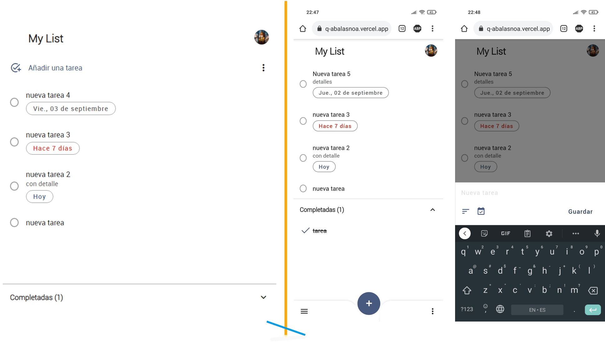
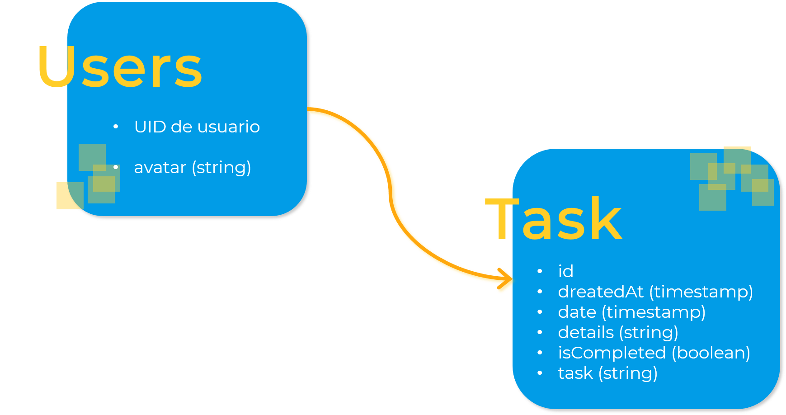

# AppTask

Web responsiva que funciona como un _To Do_, organizador de tareas. El diseño es inspirado en la app tasks de google.

### :fire: Motivación

La motivación para realizar este proyecto fue practicar el modelo CRUD y el uso de firebase (autenticación, Cloud Firestore, Cloud Storage)

[DEMO AppTask](https://apptask-323am3t9q-abalasnoa.vercel.app/opening "Web AppTask")

## Tecnologías

---

El proyecto es creado con:

- Node: 14.15.4
- React: 17.0.1
- Firebase: 8.2.1
- Date-fns: 2.23.0
- Vercel: 23.1.2
- HTML, CSS y JavaScript

## Estado del proyecto

---

El proyecto se encuentra en una versión inicial de lo que se espera como producto final. A continuación se en lista las funcionalidades que posee:

- [x] Registro e inicio de sesión con correo y contraseña.
- [ ] Registro e inicio de sesión por medio de google.
- [x] Subir y actualizar imagen de perfil.
- [x] crear, leer, actualizar y eliminar tareas.
- [ ] Crear varias listas de tarea.
- [ ] Ordenar por fecha o por orden propio.
- [ ] Agregar subtareas a las tareas.
- [ ] Agregar la vista 404.

### Bugs

- La imagen de perfil no se actualiza de forma correcta. para que el cambio de imagen persista se debe refrescar la página.
- Algunos detalles de css que se pueden mejorar.

## Instalación

---

Sigue estos pasos correr localmente el proyecto

1. Clona este repositorio usando `git clone` o descargando el ZIP
2. Ve a la carpeta del proyecto `cd to-do-list`
3. Instala las dependencias con `npm install`
4. Configura tus variables de entorno en un archivo **.env** para conectar con firebase
5. Corre en ambiente local ejecutando `npm start`
6. Disfruta de AppTask :blush:

## Estructura de la base de datos

---

La base de datos maneja una colección users que contiene una subcolección task.

### :otter: Mensaje de la desarrolladora

Si llegaste hasta aqui por favor trae más :coffee: y :cookie:, gracias :ok_hand:
